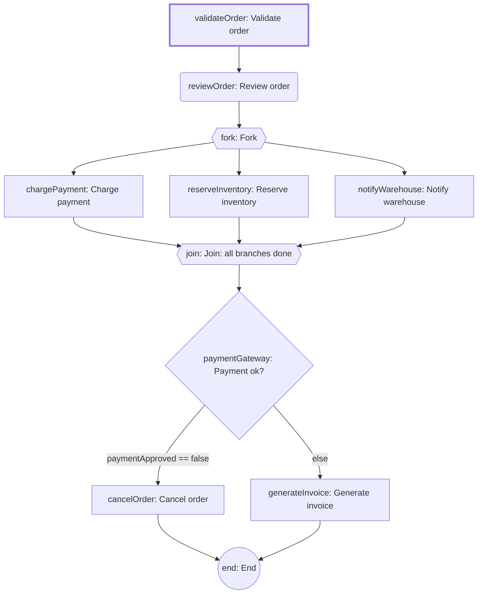
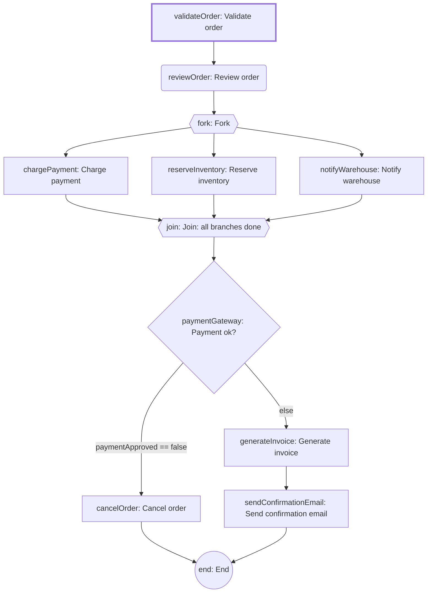

# process-engine-demo

A runnable sample app for [process-engine](../process-engine): the order-fulfillment process
below, its `StepHandler` implementations, a small web console, and the whole engine's
integration test suite.

```
validateOrder -> reviewOrder (manual) -> fork -> chargePayment    \
                                       -> reserveInventory  -> join -> paymentGateway -> cancelOrder -> end
                                       -> notifyWarehouse   /                        \-> generateInvoice -> end
```

This project is a **standalone** Maven project — it is not a module of the process-engine
reactor, has no shared parent with it, and building one never builds the other. It depends on
`process-engine-core` and `process-engine-admin` the ordinary way: versioned `<dependency>`
coordinates, resolved from your local Maven repository. Run `mvn install` in `process-engine/`
at least once (or after any change to `core`/`admin`) before building this project.

## Build & test

```powershell
mvn install                # builds this project against the locally-installed core/admin jars
mvn test                   # 69 tests -- mostly @SpringBootTest against in-memory H2, plus an ArchUnit suite
mvn spring-boot:run         # starts on :8080, deploys the demo definition on first boot
```

## Web console

Two small vanilla HTML/JS pages ship as static resources — this project's own
`src/main/resources/static/` (served at `/`) and `process-engine-admin`'s
(served at `/admin.html`, merged onto the classpath via the dependency above). No extra config,
no build step. While the app is running:

```
http://localhost:8080/            # Order Fulfillment Demo — business-user view of the sample process
http://localhost:8080/admin.html  # Admin console — deploy, inspect, pause/resume/kill/move-to-step, resolve-ambiguous, clear all data
```

Both are thin GUIs over the REST API (every button is one HTTP call — open the browser's network
tab to see the raw request/response); errors surface as a transient toast in the bottom-right
corner rather than an always-on activity log. The demo page walks through: starting an order,
completing the `reviewOrder` manual step, and watching the parallel branches/join/gateway run.
The admin console is process-agnostic and organized into two tabs (Definitions, Instances):
load/deploy definitions (with a Mermaid diagram export and per-step retry/timeout/SLA tuning,
auto-saved as you edit), start and inspect any instance, and operate on it (pause/resume/kill/
move-to-step/resolve an AMBIGUOUS step/clear all data). The instances list badges and lets you
filter for ones awaiting a user task or past a configured SLA, plus a free-text variable search
(e.g. find the instance for a given `orderId`).

## Data persistence

This app uses a file-backed H2 database (`jdbc:h2:file:./data/process-engine`, see
`application.yml`) — data persists indefinitely across restarts, in a `data/` directory created
relative to wherever the app was launched from (this project's root, if you follow the commands
above). There is no automatic cleanup or TTL. To reset to a clean slate, stop the app and delete
the `data/` directory; it's already `.gitignore`d, so nothing to un-track. (The admin console's
"Clear all data" button does the same thing at runtime, without a restart.)

The schema itself (every table, in `db/changelog/`) is created and version-tracked by Liquibase
— shipped by `process-engine-core`, run automatically on startup, before Hibernate touches
anything. Deleting `data/` also removes Liquibase's own tracking table, so the next startup
replays the changelog from scratch against an empty database — the reset instructions above
still just work.

## Walkthrough

The app auto-deploys `order-fulfillment` v1 on first startup (`DemoDataLoader`).

### 1. Inspect the deployed definition

```bash
curl -s http://localhost:8080/api/process-definitions/order-fulfillment | jq
```

### 2. Happy path: start an instance, complete the manual review, watch fork/join/gateway run

```bash
INSTANCE=$(curl -s -X POST "http://localhost:8080/api/process-instances?processKey=order-fulfillment" \
  -H "Content-Type: application/json" \
  -d '{"variables":{"orderId":"ORD-1"}}')
ID=$(echo "$INSTANCE" | jq -r .id)

# validateOrder runs automatically; reviewOrder is now ACTIVE and waiting on a human
curl -s http://localhost:8080/api/process-instances/$ID | jq '.steps'

STEP=$(curl -s http://localhost:8080/api/process-instances/$ID | jq -r '.steps[] | select(.stepKey=="reviewOrder") | .id')
curl -s -X POST http://localhost:8080/api/process-instances/$ID/steps/$STEP/complete -d '{}' -H "Content-Type: application/json"

# fork -> {chargePayment, reserveInventory, notifyWarehouse} -> join -> paymentGateway -> generateInvoice -> end
curl -s http://localhost:8080/api/process-instances/$ID | jq '.status, .variables, .steps[].stepKey'
```

### 3. Declined payment routes to cancelOrder instead

```bash
curl -s -X POST "http://localhost:8080/api/process-instances?processKey=order-fulfillment" \
  -d '{"variables":{"orderId":"ORD-2","simulateDeclined":true}}' -H "Content-Type: application/json"
# ... complete reviewOrder as above; final variables contain cancelled=true, no invoiceId
```

### 4. Retry on transient failure

`chargePayment` has `maxAttempts=3`. Passing `chargePaymentFailAttempts` makes the handler fail
that many times before succeeding — start an instance with `"chargePaymentFailAttempts": 2` and
watch `GET /api/process-instances/{id}/events` show two `STEP_RETRY_SCHEDULED` events before
`chargePayment` completes on attempt 3.

### 5. Pause / resume / kill

```bash
curl -s -X POST http://localhost:8080/api/process-instances/$ID/pause | jq .status    # -> PAUSED
curl -s -X POST http://localhost:8080/api/process-instances/$ID/steps/$STEP/complete -d '{}' \
  -H "Content-Type: application/json"   # 409 Conflict while paused
curl -s -X POST http://localhost:8080/api/process-instances/$ID/resume | jq .status   # -> RUNNING
curl -s -X POST http://localhost:8080/api/process-instances/$ID/kill | jq .status     # -> KILLED, terminal
```

### 6. Jump backward to an arbitrary step

Backward-only: the target must precede everything currently in flight, and can't land inside a
parallel fork/join's interior (see "Move to an arbitrary step is backward-only" in the
[library's README](../process-engine/README.md)). Works even after an instance has already run
to completion — this reopens it and replays from the target step, compensating any `COMPLETED`
work the jump invalidates and cancelling stale in-flight work first:

```bash
# advisory list of currently-valid backward targets, same set the admin UI's dropdown uses
curl -s http://localhost:8080/api/process-instances/$ID/move-to-step-candidates | jq

curl -s -X POST http://localhost:8080/api/process-instances/$ID/move-to-step \
  -d '{"targetStepKey":"reviewOrder"}' -H "Content-Type: application/json"
```

### 7. Permanent failure triggers saga compensation

`chargePayment` with `chargePaymentFailAttempts` set at or above `maxAttempts` (3) exhausts every
retry and fails permanently, which unwinds the whole instance:

```bash
curl -s -X POST "http://localhost:8080/api/process-instances?processKey=order-fulfillment" \
  -d '{"variables":{"orderId":"ORD-3","chargePaymentFailAttempts":99}}' -H "Content-Type: application/json"
# ... complete reviewOrder as in step 2, then:
curl -s http://localhost:8080/api/process-instances/$ID | jq '.status, .variables'
# status: FAILED; variables show inventoryReleased=true, warehouseCancellationNotified=true --
# reserveInventory/notifyWarehouse (both CompensatingStepHandler) were unwound; chargePayment
# itself stays FAILED, never COMPENSATED
curl -s http://localhost:8080/api/process-instances/$ID/events | jq '.[] | select(.type | test("COMPENSAT"))'
```

Every bundled handler also honors a generic `"<stepKey>Fail": true` start variable (see
`com.example.processengine.demo.handlers.FailSwitch`) that makes that one step always throw,
regardless of attempt count — the same permanent-failure/saga-compensation scenario as above, but
for any step, not just `chargePayment`. For example, `"generateInvoiceFail": true` fails the
instance only after all three parallel branches (`chargePayment`/`reserveInventory`/
`notifyWarehouse`) have already completed, so their `compensate()` all run.

### 8. Deploy a new version; running instances stay pinned

```bash
curl -s -X POST http://localhost:8080/api/process-definitions/order-fulfillment \
  -H "Content-Type: application/json" -d @v2-spec.json   # adds sendConfirmationEmail, becomes v2

curl -s http://localhost:8080/api/process-definitions/order-fulfillment/versions | jq '.[].version'
# instances started before this deploy keep running against v1; new starts get v2
```

See `com.example.processengine.demo.DemoProcessDefinitions` for the full v1/v2 JSON shape, and
`com.example.processengine.VersioningTest` for the same scenario as an automated test.

### 9. Live advisory warnings

`com.example.processengine.demo.DemoAdvisoryListener` is a working example of the engine's
`ProcessAdvisoryListener` extension point (see the [library's README](../process-engine/README.md)
and [ADR-020](../process-engine/docs/adr/020-advisory-listener-extension-point.md)): it turns each
of the three advisory situations into a red banner pushed live into this page over Server-Sent
Events (`GET /api/demo/warnings/stream`) — no polling, and dismissible with its own close button.
Trigger one by configuring a short SLA and letting the periodic scan catch it:

```bash
curl -s -X PUT http://localhost:8080/api/process-definitions/order-fulfillment/versions/1/steps/reviewOrder/sla \
  -H "Content-Type: application/json" -d '{"sla":"PT1S"}'
curl -s -X POST http://localhost:8080/api/process-instances?processKey=order-fulfillment \
  -H "Content-Type: application/json" -d '{"variables":{"orderId":"ORD-1"}}'
# within one scan interval (process-engine.sla.scan-interval-millis, default 60s) the page's
# banner shows "SLA breached: order ORD-1 (order-fulfillment / reviewOrder)" on its own
```

## Demo process diagrams

Static snapshots of `DemoProcessDefinitions.v1()`/`v2()`, generated by hand in the same shape the
admin console's "Export to Mermaid" button produces from any deployed definition (`admin.js`'s
`toMermaid`) — node IDs are prefixed `n_` because Mermaid treats a bare `end` node ID as a
reserved keyword, and every version here has a step literally named `end`. Pasted as-is, GitLab
(and GitHub) render these as a graph rather than a code block.

### v1



### v2

Same graph, plus `sendConfirmationEmail` spliced between `generateInvoice` and `end`.


